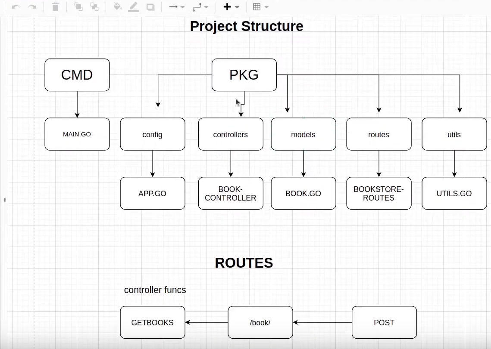
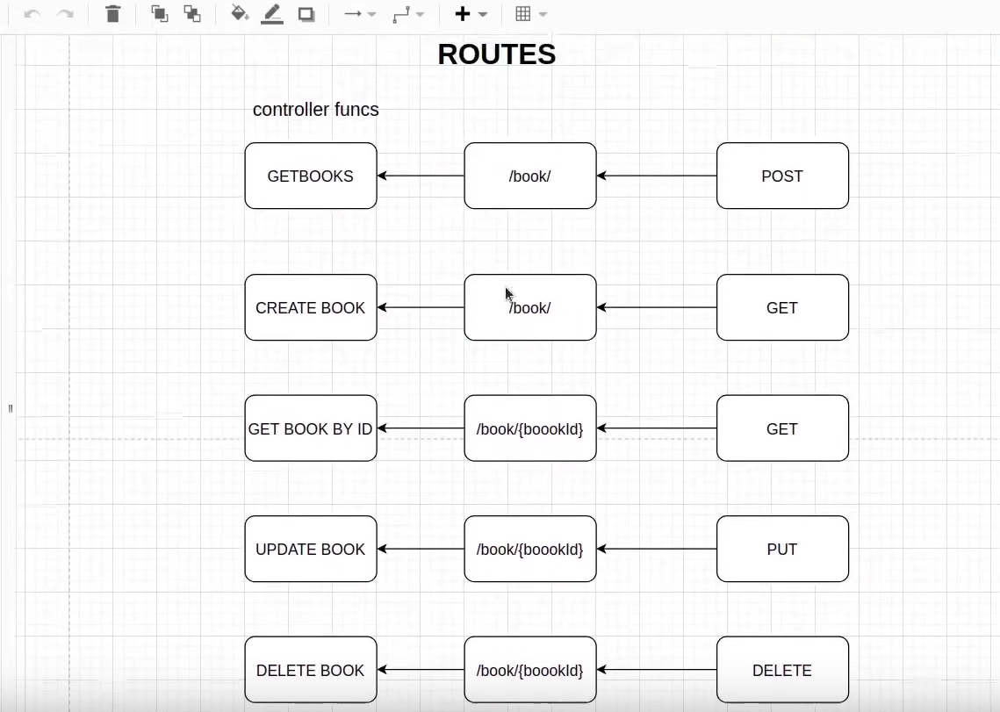

# 📘 Go-BookStore API

A simple RESTful API for managing books, built in **Go (Golang)** using:

* 📊 Gorilla Mux (for routing)
* 💃 GORM (for ORM)
* 🐬 MySQL (as database)

This project is structured in a clean and modular way, ideal for learning, personal projects, or preparing for backend interviews.

---

## 📁 Project Structure

```bash
.
├── cmd
│   └── main
│       └── main.go              # App entry point
├── go.mod                       # Go module file
├── go.sum                       # Go dependencies lock file
└── pkg
    ├── config
    │   └── app.go               # DB connection setup
    ├── controllers
    │   └── book-controller.go   # HTTP handlers (GET, POST, etc.)
    ├── models
    │   └── book.go              # Book model + DB operations
    ├── routes
    │   └── bookstore-routes.go  # Route mapping
    └── utils
        └── utils.go             # Helper functions (JSON parsing, etc.)
```

---

## 🔌 MySQL Setup (READ THIS or you’ll rage 🚤)

### 🔧 Step 1: Install & Run MySQL

On Ubuntu:

```bash
sudo systemctl start mysql
```

### 🧙 Step 2: Create a database

```sql
CREATE DATABASE simplerest;
```

### 🤝 Step 3: Create a MySQL user

```sql
CREATE USER 'ego'@'localhost' IDENTIFIED BY 'lallantap';
GRANT ALL PRIVILEGES ON simplerest.* TO 'ego'@'localhost';
FLUSH PRIVILEGES;
```

> You can change the username/password, but also update it in `app.go`.

---

## 🛠️ Configuration (DSN Setup)

In `pkg/config/app.go`, we use:

```go
dsn := "ego:lallantap@tcp(127.0.0.1:3306)/simplerest?charset=utf8mb4&parseTime=True&loc=Local"
```

Make sure:

* MySQL is running on port `3306`
* DB `simplerest` exists
* User `ego` has access

---

## 🧪 API Endpoints

| Method | Route            | Description       |
| ------ | ---------------- | ----------------- |
| GET    | `/book/`         | Get all books     |
| POST   | `/book/`         | Create a new book |
| GET    | `/book/{bookId}` | Get book by ID    |
| PUT    | `/book/{bookId}` | Update book by ID |
| DELETE | `/book/{bookId}` | Delete book by ID |

All routes were tested and verified using **Postman** ✅

---

## 🛋️ Example Payload (POST `/book/`)

```json
{
  "name": "The Subtle Art of Not Giving a F*ck",
  "author": "Mark Manson",
  "publication": "Harper"
}
```

---

## 💪 Run Locally

### 1. Clone the repo:

```bash
git clone https://github.com/tf-vishal/Go-BookStore.git
cd Go-BookStore
```

### 2. Install deps:

```bash
go mod tidy
```

### 3. Run the app:

```bash
go run cmd/main/main.go
```

API will be live at:
`http://localhost:9010`

You can test all API endpoints using **Postman**:

* `GET    http://localhost:9010/book/` → Get all books
* `POST   http://localhost:9010/book/` → Create new book
* `GET    http://localhost:9010/book/{bookId}` → Get book by ID
* `PUT    http://localhost:9010/book/{bookId}` → Update book
* `DELETE http://localhost:9010/book/{bookId}` → Delete book

---

## 🔍 Code Snippets (Visual)

### 📘 Book Model



### 🧭 Route Structure



---

## 📦 Tech Stack

* Golang
* Gorilla Mux
* GORM
* MySQL

---


## 🙌 Credits

This project was built by **@tf-vishal** as part of a hands-on learning journey, following the amazing YouTube tutorials by **Akhil Sharma** 📺.

> Huge shoutout to Akhil Sharma for creating such a beginner-friendly and practical tutorial series — his content laid the foundation, and this repo is a result of building everything step-by-step while learning and debugging along the way.

💪 Modified, debugged, and extended by Vishal Sharma — from setting up MySQL and GORM to fixing broken tags and connection errors.

> Learning by doing > Copy-pasting. This is how devs evolve 💻🔥
